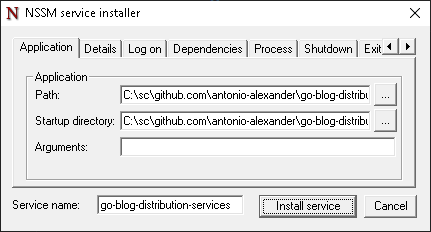
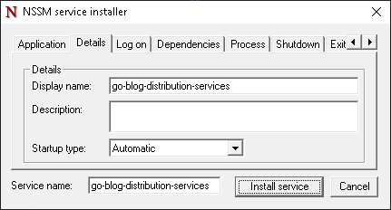
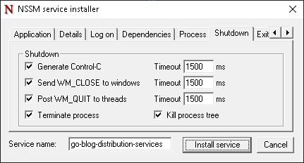
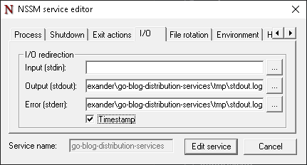
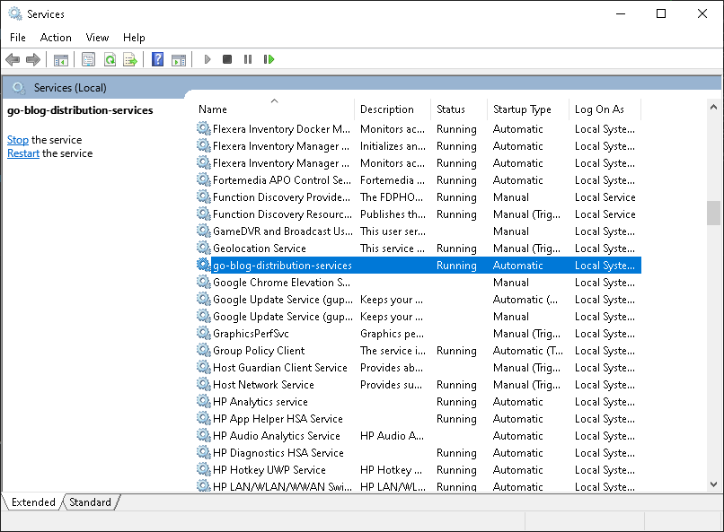
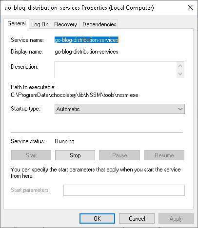

# go-blog-distribution-services (github.com/antonio-alexander/go-blog-distribution-services)

The purpose of this repo is to demonstrate alternative solutions for distribution of a Go application/executable. In general, Docker is the defacto solution for distribution and fortunately I've been around long enough to have distributed applications I wrote in executables and installers so I know it's possible; but I'm re-discovering how to do it now and even back then it was with LabVIEW and not just a random executable.

> With that said, let me preface this with saying I have a lot of experience with application distribution; so this document will focus on the important aspects without going through the process of discovering what makes something important

Upon completion of this you should:

- know the common components between different distribution methods
- be able to draw comparisons between Docker and Services (possibly even arguing one solution over the other given certain circumstances)
- know how to create a service in windows using NSSM
- know how to create a service in linux
- have at least one solution of how to automate installation of a service for windows
- have at least one solution of how to automate installation of a service for linux

Assumptions/Omissions

- I won't do the effort of showing how to build a Go application for different architectures

## Bibliography

These are some of the links that I used to put this together:

- [https://www.digitalocean.com/community/tutorials/using-ldflags-to-set-version-information-for-go-applications](https://www.digitalocean.com/community/tutorials/using-ldflags-to-set-version-information-for-go-applications)
- [https://stackoverflow.com/questions/63178036/how-to-find-commit-hash-from-within-a-running-docker-image](https://stackoverflow.com/questions/63178036/how-to-find-commit-hash-from-within-a-running-docker-image)
- [https://stackoverflow.com/questions/6245570/how-to-get-the-current-branch-name-in-git](https://stackoverflow.com/questions/6245570/how-to-get-the-current-branch-name-in-git)
- [https://github.com/puppetlabs/nssm/blob/master/README.txt](https://github.com/puppetlabs/nssm/blob/master/README.txt)
- [https://stackoverflow.com/questions/225275/how-to-force-uninstallation-of-windows-service](https://stackoverflow.com/questions/225275/how-to-force-uninstallation-of-windows-service)
- [https://travis-ci.community/t/socket-the-requested-service-provider-could-not-be-loaded-or-initialized/1127/2](https://travis-ci.community/t/socket-the-requested-service-provider-could-not-be-loaded-or-initialized/1127/2)
- [https://adamtheautomator.com/goto-batch/](https://adamtheautomator.com/goto-batch/)
- [https://stackoverflow.com/questions/14905876/how-to-return-an-error-code-without-closing-the-command-prompt-window](https://stackoverflow.com/questions/14905876/how-to-return-an-error-code-without-closing-the-command-prompt-window)
- [https://stackoverflow.com/questions/26551/how-can-i-pass-arguments-to-a-batch-file](https://stackoverflow.com/questions/26551/how-can-i-pass-arguments-to-a-batch-file)
- [https://stackoverflow.com/questions/1421441/batch-not-equal-inequality-operator](https://stackoverflow.com/questions/1421441/batch-not-equal-inequality-operator)
- [https://www.tutorialspoint.com/batch_script/batch_script_if_else_statement.htm](https://www.tutorialspoint.com/batch_script/batch_script_if_else_statement.htm)
- [https://stackoverflow.com/questions/334879/how-do-i-get-the-application-exit-code-from-a-windows-command-line](https://stackoverflow.com/questions/334879/how-do-i-get-the-application-exit-code-from-a-windows-command-line)
- [https://www.tutorialspoint.com/batch_script/batch_script_variables.htm](https://www.tutorialspoint.com/batch_script/batch_script_variables.htm)
- [https://github.com/puppetlabs/nssm/blob/a1c32603645df5c4b0b0a13b89a51db06340c1b2/README.txt#L758](https://github.com/puppetlabs/nssm/blob/a1c32603645df5c4b0b0a13b89a51db06340c1b2/README.txt#L758)

- [https://medium.com/@benmorel/creating-a-linux-service-with-systemd-611b5c8b91d6](https://medium.com/@benmorel/creating-a-linux-service-with-systemd-611b5c8b91d6)
- [https://sites.google.com/site/tfsidc/create-a-network-service](https://sites.google.com/site/tfsidc/create-a-network-service)
- [https://en.wikipedia.org/wiki/Systemd](https://en.wikipedia.org/wiki/Systemd)
- [https://serverfault.com/questions/413397/how-to-set-environment-variable-in-systemd-service](https://serverfault.com/questions/413397/how-to-set-environment-variable-in-systemd-service)

- [https://en.wikipedia.org/wiki/Inetd](https://en.wikipedia.org/wiki/Inetd)
- [https://en.wikipedia.org/wiki/Xinetd](https://en.wikipedia.org/wiki/Xinetd)
- [https://en.wikipedia.org/wiki/Launchd](https://en.wikipedia.org/wiki/Launchd)

## Sample Application

The sample application included in this repo is a copy+paste of the same REST application from [github.com/antonio-alexander/go-hello-world](github.com/antonio-alexander/go-hello-world); that repo has an excellent implementation of the docker distribution method (but fewer comments). The sample application is simply a hello-world rest server which when you connect to it will display hello-world and give you some versioning information.

To build the sample application for windows (using git bash), do the following:

```sh
VERSION=`cat ./version.json | jq '.version' | sed 's/"//g'`
GIT_BRANCH=`git rev-parse --abbrev-ref HEAD`
GIT_COMMIT=`git rev-parse HEAD`
GOOS=windows
go build -o ./tmp/sample_application.exe -ldflags "-X github.com/antonio-alexander/go-blog-distribution-services/cmd/internal.Version=${VERSION} -X github.com/antonio-alexander/go-blog-distribution-services/cmd/internal.GitCommit=${GIT_COMMIT} -X github.com/antonio-alexander/go-blog-distribution-services/cmd/internal.GitBranch=${GIT_BRANCH}" ./cmd/main.go
```

> You may be asking yourself why go through the trouble of baking in the version, git branch and git commit into the executable, but continuity is super important (even for something as simple as this); with this continuity if a bug happens, you have a way to know the exact version of the code that was being used when creating the bug

To build the sample application for linux, do the following:

```sh
VERSION=`cat ./version.json | jq '.version' | sed 's/"//g'`
GIT_BRANCH=`git rev-parse --abbrev-ref HEAD`
GIT_COMMIT=`git rev-parse HEAD`
GOOS=linux
go build -o ./tmp/sample_application -ldflags "-X github.com/antonio-alexander/go-blog-distribution-services/cmd/internal.Version=${VERSION} -X github.com/antonio-alexander/go-blog-distribution-services/cmd/internal.GitCommit=${GIT_COMMIT} -X github.com/antonio-alexander/go-blog-distribution-services/cmd/internal.GitBranch=${GIT_BRANCH}" ./cmd/main.go
CHMOD +x ./tmp/sample_application
```

Once the application is build, you can run it with:

```sh
./tmp/sample_application.exe 
starting web server on :8080
```

You can stop the application with ctrl+c and you should get the following:

```sh
error generated by server: http: Server closed
```

<!-- TODO: once configuration is implemented talk about it -->

Congratulations, you've built your first application (again); this is the basis on which the remainder of this article depends on.

## Problems to Solve for Distribution

One way to approach this conversation is to think about what Docker does for you; I think it's a bit roundabout, but it's likely that you're very familiar with Docker (in general) and can draw more parallels to it than other solutions. Docker provides the following functionality:

- a way to start/stop your application
- a way to get the console logs for your application
- a way to restart your application if it fails

Indirectly (not through Containers); it provides this other functionality:

- through docker-compose, a way to orchestrate it with other [serparate] applications
- through docker images, a way to version the application code themselves
- through docker images, a way to ship any additional artifacts
- through docker-compose/container a way to configure the environment via args/environmental variables
- through docker-compose a way to setup/configure the network and exposed ports
- through docker-compose/docker pull a way to upgrade or install the application
- through docker daemon what local user owns the process/access to the operating system
- through docker daemon what limits each application has on cpu/memory usage
- through docker daemon what files the application has access to

So any solution we create using a service has to _somewhat_ solve those same challenges or at least know the analog to those challenges using those solutions

## Creating a Windows Service

Once upon a time I did IT (Information Technology) and one of the easier ways to get a service into a Windows machine; was to use the Non Sucky Service Manager (NSSM). This was a command line utility that would effectively wrap any application into a windows service and provide the following functionality (as described above):

- a way to start/stop your application
- a way to get the console logs
- a way to (automatically) restart your application if it fails

I think it's easier/easiest to install nssm using Choco (but you can also download it from their website):

```pwsh
PS C:\Windows\system32> choco install nssm
Chocolatey v2.2.2
3 validations performed. 2 success(es), 1 warning(s), and 0 error(s).

Validation Warnings:
 - A pending system reboot request has been detected, however, this is
   being ignored due to the current Chocolatey configuration.  If you
   want to halt when this occurs, then either set the global feature
   using:
     choco feature enable --name="exitOnRebootDetected"
   or pass the option --exit-when-reboot-detected.

Installing the following packages:
nssm
By installing, you accept licenses for the packages.
Progress: Downloading NSSM 2.24.101.20180116... 100%

nssm v2.24.101.20180116 [Approved]
nssm package files install completed. Performing other installation steps.
The package nssm wants to run 'chocolateyInstall.ps1'.
Note: If you don't run this script, the installation will fail.
Note: To confirm automatically next time, use '-y' or consider:
choco feature enable -n allowGlobalConfirmation
Do you want to run the script?([Y]es/[A]ll - yes to all/[N]o/[P]rint): A

Installing 64 bit version
Extracting C:\ProgramData\chocolatey\lib\NSSM\tools\nssm-2.24-101-g897c7ad.zip to C:\ProgramData\chocolatey\lib\NSSM\tools...
C:\ProgramData\chocolatey\lib\NSSM\tools
 ShimGen has successfully created a shim for nssm.exe
 The install of nssm was successful.
  Software installed to 'C:\ProgramData\chocolatey\lib\NSSM\tools'

Chocolatey installed 1/1 packages.
 See the log for details (C:\ProgramData\chocolatey\logs\chocolatey.log).
PS C:\Windows\system32> nssm --version
NSSM 2.24-101-g897c7ad 64-bit 2017-04-26
```

> Keep in mind both choco and nssm require administrator privileges

Once NSSM is installed, we can use it to create a windows service; we can do this via the GUI:

```pwsh
PS C:\Windows\system32> nssm install go-blog-distribution-services
```






To create this via the command line, you can enter the following:

> Keep in mind that although you can supply a relative path, the relative path would have to be in relation to nssm rather than the directory you're running the command from

```pwsh
nssm install go-blog-distribution-services c:/tmp/sample_application.exe
nssm set go-blog-distribution-services Description "sample_application service to prove nssm use case"
```

Once the service is installed, you can start it with:

```pwsh
PS C:\Windows\system32> nssm start go-blog-distribution-services
```

Once a service is installed and started, you can verify it by running the services commandlet (or go to start > run > services.msc); you should also be able to access the sample application through a browser by using the configured port.




You can use the event viewer to see logs for nssm's interaction with your application, or with the io redirection configured; you can look at the log from the configured log file. You may be pushed to have separate files for standard out and standard error but as most of our applications would only print to standard error on failure, it probably makes sense to put them all in the same file.

You can edit an existing service using the following command:

```pwsh
nssm edit go-blog-distribution-services
```

Editing is useful for doing things like setting the standard output, or adding environmental variables or the like, but we'll get more into that when we get into [automation](#automating-installation-of-a-windows-service).

You can remove/delete an existing service with NSSM using the following command:

```pwsh
nssm remove go-blog-distribution-services confirm
```

> Adding the confirm to the end will ensure that nssm won't ask for confirmation

Generally, I've found that after removing a service, you'll need to restart the machine; this Stack Overflow [link](https://stackoverflow.com/questions/225275/how-to-force-uninstallation-of-windows-service) says to just not have services.msc open when doing it.

## Automating Installation of a Windows Service

A strong assumption is that you need an automated way to install, uninstall and [possibly] upgrade an existing service; obvious-ness around database schemas/table migration aside; you'll need some way to upgrade the executable (and artifacts) for the application. We'll want to automate two flows: (1) installation/upgrade and (2) uninstallation.

> Temper your expectations in that this will be an overly simple upgrade proving that its possible; I _know_ that in production or in something finished; the install/upgrade/uninstall process could be significantly more complex (think dependencies)

The install process, should have the following steps:

1. validate if nssm is installed, if not exit
2. determine if the service is already installed; if so do the following:
   a. stop the service
   b. delete/replace the application and any artifacts in the installed folder
   c. reconfigure the service with all of its configuration
   d. set startup type to manual
3. if the service is not already installed; do the following:
   a. copy the application and any artifacts in the install folder
   b. create the service using nssm
   c. reconfigure the service with all of its configuration
   d. set startup type to manual
4. start the service
5. validate that the service is running
6. smoke test the service to confirm functionality
7. set startup type to automatic for service

The uninstall process (while less exciting); should be as follows:

1. validate if nssm is installed, if not, exit
2. determine if the service is already installed; if so do the following:
   a. stop the service
   b. delete the service
   c. delete the application and any artifacts

Before we begin the work of creating the automation scripts (I plan to do bash and batch files); we need to know how to configure the service; things we're interested in are table stakes, we want to configure the following:

- command line arguments
- logging standard out and err (io redirection, with or without timestamp)
- environmental variables
- startup directory
- display name
- description
- startup type
- log on as (local system account is ok)

At a glance, configuring these items via the command line is a bit of an art, so although you won't see it here, know that a lot of trial an error occurred to figure out each configuration parameter. To configure the above, you should do the following once you've created (but not started) the service:

```pwsh
nssm set go-blog-distribution-services Description "A sample application deployed as a windows service"
nssm set go-blog-distribution-services Start SERVICE_DEMAND_START
nssm set go-blog-distribution-services AppEnvironment :KEY=VALUE
nssm set go-blog-distribution-services AppEnvironment +KEY2=VALUE2
nssm set go-blog-distribution-services ObjectName LocalSystem
nssm set go-blog-distribution-services DisplayName go-blog-distribution-services
nssm set go-blog-distribution-services AppStdout "C:\sc\sample_application.log"
nssm set go-blog-distribution-services AppStderr "C:\sc\sample_application.log"
nssm set go-blog-distribution-services AppDirectory c:/tmp
nssm set go-blog-distribution-services AppExit Default Restart
nssm set go-blog-distribution-services Type SERVICE_WIN32_OWN_PROCESS
nssm set go-blog-distribution-services AppParameters --arg
```

> There's a bit here about interactive services; I've done it before; it's cool...it's probably not what you want

Once we know how to configure a service on update/configuration; we ca n build a script to perform an update or installation. After I did all the research to figure out how to do the configuration, I found out there's a dump command that simplifies a lot of this:

```pwsh
nssm dump go-blog-distribution-services
```

Once we have properly installed and configured the service, we can configure it to auto start and then start it with the following commands:

```pwsh
nssm set go-blog-distribution-services Start SERVICE_AUTO_START
nssm start go-blog-distribution-services
```

With that said, we can put together a script to install a service with the following code:

```batch
@echo off
:: KIM: there's an assumption this is running from the directory containing the scripts

:: populate variables
set service_name=go-blog-distribution-services
set service_location=c:\tmp\go-blog-distribution-services\
set service_artifacts=.\tmp\
IF NOT [%1] == [] (set service_location=%1)
IF NOT [%2] == [] (set service_artifacts=%2)
IF NOT [%3] == [] (set service_name=%3)

:: create service location folder (we don't care if this fails)
mkdir "%service_location%"

:: determine if service already exists
nssm status %service_name%
if %errorlevel%==0 (GOTO update) else (GOTO install)

:update
echo "uninstalling..."
:: stop the service (we don't care if this fails because it could already be stopped)
nssm remove %service_name% confirm
if NOT "%errorlevel%"=="0" GOTO error

:install
echo "installing..."
:: copy the executable into a specified destination (with default) with any artifacts
xcopy %service_artifacts% %service_location% /Y
if NOT "%errorlevel%"=="0" GOTO error
:: install the service
nssm install %service_name% %service_location%sample_application.exe
if NOT "%errorlevel%"=="0" GOTO error
:: set any configuration
nssm set %service_name% Description "A sample application deployed as a windows service"
if NOT "%errorlevel%"=="0" GOTO error
nssm set %service_name% AppEnvironment :HTTP_PORT=8080
if NOT "%errorlevel%"=="0" GOTO error
nssm set %service_name% AppEnvironment :SYSTEMROOT=c:\windows
if NOT "%errorlevel%"=="0" GOTO error
nssm set %service_name% ObjectName LocalSystem
if NOT "%errorlevel%"=="0" GOTO error
nssm set %service_name% DisplayName go-blog-distribution-services
if NOT "%errorlevel%"=="0" GOTO error
nssm set %service_name% AppStdout %service_location%\sample_application.log
if NOT "%errorlevel%"=="0" GOTO error
nssm set %service_name% AppStderr %service_location%\sample_application.log
if NOT "%errorlevel%"=="0" GOTO error
nssm set %service_name% AppDirectory %service_location%
if NOT "%errorlevel%"=="0" GOTO error
nssm set %service_name% AppExit Default Restart
if NOT "%errorlevel%"=="0" GOTO error
nssm set %service_name% Type SERVICE_WIN32_OWN_PROCESS
if NOT "%errorlevel%"=="0" GOTO error
nssm set %service_name% AppParameters --arg
if NOT "%errorlevel%"=="0" GOTO error
nssm set %service_name% Start SERVICE_DEMAND_START
:: wait for some seconds

:: start the service
nssm start %service_name%
if NOT "%errorlevel%"=="0" GOTO error
:: perform a smoke test for the service
:: set the service to automatically run
nssm set %service_name% Start SERVICE_AUTO_START
if NOT "%errorlevel%"=="0" GOTO error
echo "installation successful"
exit /b

:error
echo "error has occured:"%errorlevel%

exit /b 1
```

This would be a script to uninstall the service:

```batch
@echo off
:: KIM: there's an assumption this is running from the directory containing the scripts

:: populate variables
set service_name=go-blog-distribution-services
set service_location=c:/tmp/go-blog-distribution/
IF NOT [%1] == [] (set service_location=%1)
IF NOT [%2] == [] (set service_name=%2)

:: determine if service already exists
nssm status %service_name%
if %errorlevel%==0 (GOTO uninstall) else (GOTO not_installed)

:not_installed
echo %service_name% not installed
exit /B

:uninstall
:: uninstall service
echo "uninstalling..."
nssm stop %service_name%
if NOT "%errorlevel%"=="0" GOTO error
nssm remove %service_name% confirm
if NOT "%errorlevel%"=="0" GOTO error
:: delete application
echo "removing application..."
rmdir /S /Q %service_location%
if NOT "%errorlevel%"=="0" GOTO error
echo "uninstallation successful"
exit /B

:error
echo "error has occured:"%errorlevel%
exit /B 1
```

## Creating a Linux Service

Linux services are a bit different from services in Windows because they're natively supported: you don't have to _add_ code to get the service up and running; you use what's already there. Creating a service in Windows has a few extra steps (hence why we use NSSM), but linux isn't without it's hurdles. Linux has a number of implementations (throughout the ages haha):

- systemd: is a software suite that provides an array of system components for Linux operating systems. The main aim is to unify service configuration and behavior across Linux distributions
- inetd/xinetd: (Extended Internet Service Daemon) is an open-source super-server daemon which runs on many Unix-like systems, and manages Internet-based connectivity
- launchd: is an init and operating system service management daemon created by Apple Inc. as part of macOS to replace its BSD-style init and SystemStarter

We'll start with systemd systemd because it's what comes with Ubuntu (and is used in ChromeOS). This was obscenely easy. I followed a [medium article](https://medium.com/@benmorel/creating-a-linux-service-with-systemd-611b5c8b91d6) and was able to get something functional in a few minutes. The steps to get a service up and running with systemd is the following:

1. build the sample application (make sure you install jq)
2. create and populate a service file for systemd/systemctl for the sample application
3. use systemctl to start the service
4. verify the service is started using systemctl
5. verify the service is functioning using a browser/curl

When building the application, take care to know where it installs it at, use go install or copy+paste into a known folder/directory. You'll need this when we're configuring the service file.

> I think this is obvious...but be sure that you build it for linux...and you make it executable; these are problems you'll eventually be able to solve, but you can save yourself the trouble

The service file itself can start here (more on this later):

```systemctl
[Unit]
Description=go-blog-distribution-services
After=network.target
StartLimitIntervalSec=0

[Service]
Type=simple
Restart=always
RestartSec=1
User=daemon
ExecStart=/usr/bin/sample_application
Environment="HTTP_PORT=8081"
Environment="HTTP_ADDRESS="

[Install]
WantedBy=multi-user.target
```

Once you have this file created, you can move it to _/etc/systemd/system_ and then run the follwing commands:

```sh
sudo systemctl start go-blog-distribution-services
sudo systemctl status go-blog-distribution-services
● go-blog-distribution-services.service - go-blog-distribution-services
     Loaded: loaded (/etc/systemd/system/go-blog-distribution-services.service; disabled; vendor preset: enabled)
    Drop-In: /run/systemd/system/service.d
             └─zzz-lxc-service.conf
     Active: active (running) since Fri 2023-12-29 21:36:57 CST; 3s ago
   Main PID: 11983 (sample_applicat)
      Tasks: 7 (limit: 3311)
     Memory: 948.0K
     CGroup: /system.slice/go-blog-distribution-services.service
             └─11983 /usr/bin/sample_application

Dec 29 21:36:57 penguin systemd[1]: Started go-blog-distribution-services.
Dec 29 21:36:57 penguin env[11983]: starting web server on :8080
```

Once the installation has occurred and the service has been started, you should be able to validate that the service is running as expected using a browser/curl and the systemctl status command. Once the service has been installed/started, you can stop it using:

```sh
systemctl stop go-blog-distribution-services
```

You can also configure the service to start on boot using the following command:

```sh
systemctl enable go-blog-distribution-services
```

You can view the logs for this service by using the following command:

```sh
sudo journalctl -u go-blog-distribution-services --since "5 minutes ago"
```

```sh
Dec 29 21:36:57 penguin systemd[1]: Started go-blog-distribution-services.
Dec 29 21:36:57 penguin env[11983]: starting web server on :8080
Jan 01 21:16:36 penguin systemd[1]: Stopping go-blog-distribution-services...
Jan 01 21:16:36 penguin env[11983]: http: Server closed
Jan 01 21:16:36 penguin systemd[1]: go-blog-distribution-services.service: Succeeded.
Jan 01 21:16:36 penguin systemd[1]: Stopped go-blog-distribution-services.
Jan 01 21:16:36 penguin systemd[1]: Started go-blog-distribution-services.
Jan 01 21:16:37 penguin env[14052]: starting web server on :8081
```

## Frequently Asked Questions

What if my service has dependencies on other services?

> For NSSM, you can set dependencies by using the DependsOnService directive, while for Systemd you can use the after directive. This isn't a _great_ way to structure dependencies for an application, not because it doesn't work, just because it's generally fragile. I think in practice, this should be used for OS/system level things like networking or an OS-level service and in addition to that, you should have fallback code that can handle situations where the service isn't available, just because you depend on a service doesn't mean that service is ready to receive requests and even if it "was" ready to receive requests, there's no guarantee that it'll be ready when your service starts (or restarts). Services that can't handle this can cause CPU usage to spike for environments with fewer resources; better to validate/check on a timer

What if I want to rotate log files?

> NSSM has some options for rotating log files, in the same vein so does systemctl (journalctl); there's plenty of documentation online to figure out how to do this. I think this is a great time to consider how your service should handle logging and what your needs are for logging

What if I get this error: "socket: The requested service provider could not be loaded or initialized."?

> This is a weird one, I got it when using NSSM and it was because the environment was empty; specifically the SYSTEMROOT environmental variable was missing. This is used under the hood for networking operations and if it isn't set the network stuff doesn't load and you get this error

What user should we run the service as?

> This is a great security question, it's outside the scope of this document, but in general you should have an idea of what permissions the user has and ideally it's a non-interactive user
